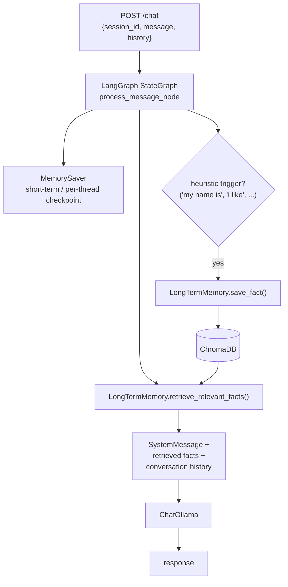

# 🧪 Memory Lab


> Standalone laboratory for testing short- and long-term conversational memory strategies.

## Problem & Goal

Local LLMs have a limited context window, and naive chat apps either forget everything between sessions or blow the context budget by replaying full history every turn. Memory Lab tests a two-tier memory architecture — LangGraph's built-in `MemorySaver` checkpointing for short-term (within-session) history, plus a ChromaDB-backed long-term store for facts extracted across the conversation — and lets you probe how well a given model actually uses retrieved facts versus ignoring them.

## Architecture



`session_id` maps to LangGraph's `thread_id`, so short-term memory persists across turns within a session for as long as the API process stays up. Long-term fact extraction currently uses simple keyword heuristics (`"my name is"`, `"i like"`, ...) rather than an LLM-based extractor — see Extension Points.

## Concrete Metrics

| Metric | Description |
|---|---|
| Fact recall accuracy | % of previously-stated facts correctly surfaced in later, semantically-related turns |
| Context window degradation | Response quality/consistency as conversation length grows past what fits in a single prompt |

Use the **Memory Lab** tab's multi-turn chat to probe both — state a fact, change topic, then ask something that requires recalling it.

## Extension Points

- **Fact extraction**: replace the keyword-heuristic trigger in `process_message_node` with an LLM-based extraction call for more reliable, less brittle fact capture.
- **Long-term store**: `LongTermMemory` wraps ChromaDB directly — swappable for any vector store behind the same `save_fact` / `retrieve_relevant_facts` interface.
- **LLM Provider**: `OLLAMA_HOST` / `OLLAMA_DEFAULT_MODEL` env vars, shared convention with the other labs.

## Setup

```bash
cd ../../LLMOpsPlatform/llmops-platform && docker compose up -d ollama chromadb

cd ../../MemoryLab/memory-lab
python -m venv .venv && source .venv/bin/activate  # .venv\Scripts\activate on Windows
pip install -e .
uvicorn memory_lab.api:app --reload --port 8006
```

Or via the full stack (`docker compose up --build` from `LLMOpsPlatform/llmops-platform`), and interact through the **Memory Lab** tab in the [Studio UI](../../LLMOpsUI), or as a `conversational_memory` node in a Studio DAG.
